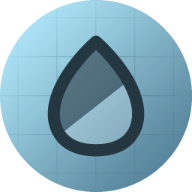
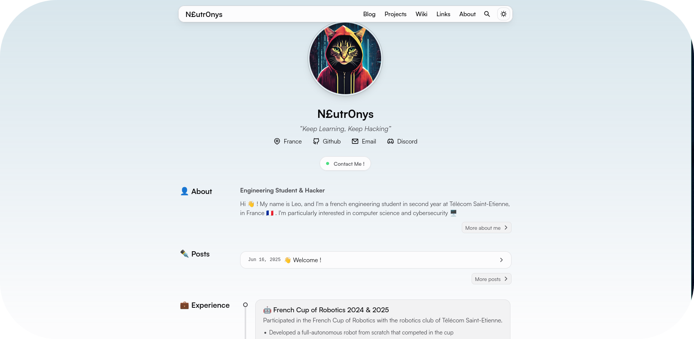

<div align="center"></div>
<br>
<h1 align="center">Portfolio</h1>

<div align="center">


 <br>


 

</div>

## Table of Contents
- [Table of Contents](#table-of-contents)
- [🌟 Showcase](#-showcase)
- [❤️ Thanks](#️-thanks)
- [📖 About](#-about)
- [📦 Structure](#-structure)
- [📚 Libraries](#-libraries)
- [🚀 Install \& Run](#-install--run)
- [📜 License](#-license)


## 🌟 Showcase



## ❤️ Thanks

A big thank to [**CWorId**](https://github.com/cworld1) for his beautiful [**Astro
template**](https://github.com/cworld1/astro-theme-pure) that I took time to configure and customise
to my needs.

**You can go check out his work !**

## 📖 About

This repository hosts the source code for my [Portfolio](https://leoraclet.github.io/).

## 📦 Structure

**Directories**

- [**`src`**](./src/) – Main source directory
  - [**`assets`**](./src/assets/) – Contains images, icons, and other static assets
  - [**`components`**](./src/components/) – Reusable custom components
  - [**`content`**](./src/content/) – Blog posts written in Markdown
  - [**`layout`**](./src/layouts/) – Reusable layout components for content pages
  - [**`pages`**](./src/pages/) – Defines the structure and routing of site pages
  - [**`plugins`**](./src/plugins/) – Lightweight enhancements for blog content


**Files**
 - [**deploy.yml**](./.github/workflows/deploy.yml) - Automatic worflow to deploy on Github pages
   when Push.

## 📚 Libraries

> [!NOTE]
>
> Those are only the main libraries, but you can find the rest in [`packages.json`](./package.json)

- [**Astro**](https://astro.build/) - The web framework for content-driven websites
- [**Astro-pure**]() - Astro portfolio template

## 🚀 Install & Run

First, ensure you have [**bun**](https://bun.com/) installed on your system.

Then, clone the repo

```bash
git clone https://github.com/leoraclet/leoraclet.github.io
cd leoraclet.github.io
```

Install dependencies

```bash
bun install
```

And now you can run the developement server using

```bash
bun run dev
```

You can also build and preview the production server using

```bash
bun run build
bun run preview
```

## 📜 License

This project is licensed under the Apache-2.0 License - see the [LICENSE](LICENSE) file for details.