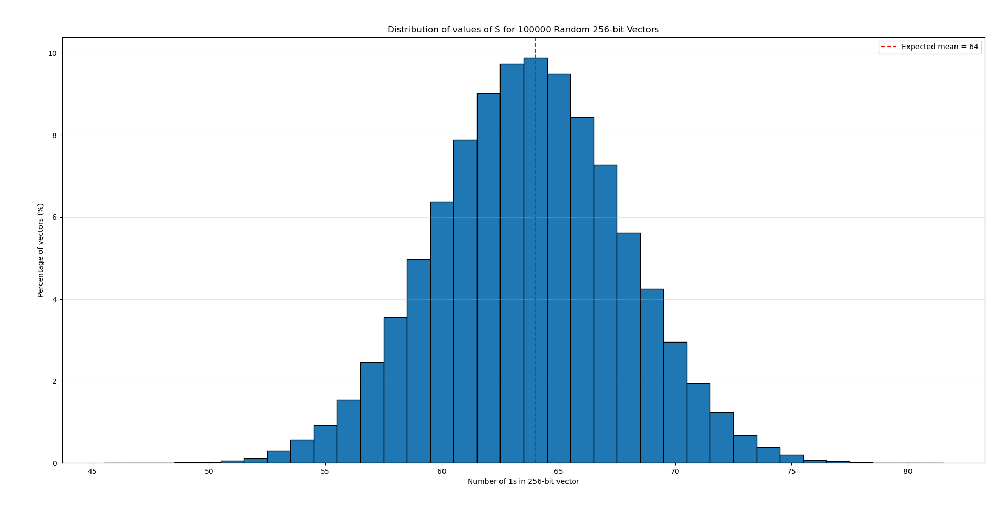

<!-- markdownlint-disable MD033 -->
<!-- markdownlint-disable MD041 -->
<!-- markdownlint-disable MD013 -->

This blog post is a write-up that will cover specifically the 3 parts of the challenge **"Pas functional encryption"** proposed during the 2026 edition of the 404CTF.

<!--more-->

## Part [1/3]

| Points | Difficulty | Solves |
| :----: | :--------: | :----: |
| **162**  |  😑   | **81**     |

### Description

> Votre collègue du bureau d'à côté, M. Jordan, est fan de vecteurs. Le problème : il préfère les garder pour lui ! Il a même mis au point un système permettant de faire des opérations basiques sur ces derniers tout en les gardant sercrets. Au bout du rouleau, vous décidez d'attaquer son système et retrouver son précieux vecteur
>
> `nc challenge.404ctf.fr 10001`

### Code

The following source code was provided :

```python {linenos=table,filename="pas-functional-encryption-1.py"}
from sage.all import *
import json
import os
from Crypto.Random.random import randrange

FLAG = os.getenv("FLAG")

# NIST P256
p = 0xFFFFFFFF00000001000000000000000000000000FFFFFFFFFFFFFFFFFFFFFFFF
K = GF(p)
a = K(0xFFFFFFFF00000001000000000000000000000000FFFFFFFFFFFFFFFFFFFFFFFC)
b = K(0x5AC635D8AA3A93E7B3EBBD55769886BC651D06B0CC53B0F63BCE3C3E27D2604B)
E = EllipticCurve(K, (a, b))
E.set_order(0xFFFFFFFF00000000FFFFFFFFFFFFFFFFBCE6FAADA7179E84F3B9CAC2FC632551 * 0x1)

K2 = GF(E.order())

INSTANCE_SIZE = 256
TRIES = 300


# According to https://eprint.iacr.org/2015/608.pdf
def setup():
    g, h = E.random_element(), E.random_element()
    s = vector(K2, [K2.random_element() for _ in range(INSTANCE_SIZE)])
    t = vector(K2, [K2.random_element() for _ in range(INSTANCE_SIZE)])

    hi = []
    for si, ti in zip(s, t):
        hi.append(si * g + ti * h)

    return g, h, hi, s, t


def keygen(s, t, x):
    return s * x, t * x


def encrypt(g, h, hi, y):
    r = K2.random_element()
    C = r * g
    D = r * h
    Ei = []
    for yi, hi_element in zip(y, hi):
        Ei.append(yi * g + r * hi_element)

    return C, D, Ei


def decrypt(g, x, sx, tx, C, D, Ei, log_table=None):
    partial_decrypt = sum([xi * ei for xi, ei in zip(x, Ei)])
    partial_decrypt -= K2(sx) * C + K2(tx) * D

    if log_table:
        return log_table[partial_decrypt]
    else:
        return partial_decrypt.log(g)


def get_random_vector():
    return vector(K2, [randrange(0, 2) for _ in range(INSTANCE_SIZE)])


# Convenient functions to print to json
# format some sagemath types
def encode_vector(v):
    return [int(e) for e in v]


def encode_ct(C, D, Ei):
    return (
        encode_vector(list(C)),
        encode_vector(list(D)),
        [encode_vector(list(ei)) for ei in Ei],
    )


if __name__ == "__main__":
    g, h, hi, s, t = setup()
    ciphertext = None
    random_vector = None

    rq = 0
    while rq < TRIES:
        action = input(
            "What should I do ?\n\t1 Get a key for a vector\n\t2 Get an encrypted vector\n\t3 Check\n>>> "
        )
        rq += 1

        if action == "1":
            y = get_random_vector()
            sx, tx = keygen(s, t, y)
            print(json.dumps({"g": encode_vector(list(g)), "sx": int(sx), "tx": int(tx), "y": encode_vector(y)}))

        elif ciphertext is None and action == "2":
            random_vector = get_random_vector()

            ciphertext = encrypt(g, h, hi, random_vector)

            # Convert to integers so that we can dump it
            C_encoded, D_encoded, Ei_encoded = encode_ct(*ciphertext)
            print(
                json.dumps({"C": C_encoded, "D": D_encoded, "Ei": Ei_encoded})
            )

        elif ciphertext is not None and action == "3":
            vector = json.loads(input("What is your guess ?\n>>> "))

            if encode_vector(vector) == encode_vector(random_vector):
                print(f"Congratz ! Here is your flag {FLAG}")
            else:
                print("Nope :/")
                exit(1337)

        else:
            print("Invalid action")
            exit(1234)
```

### First analysis

There is a bit of code, so let's take a look step by step at the important parts of this challenge.

#### Parameters

First, the code defines an Elliptic Curve $E$ over a finite field of order $P_1$ based on the standard curve [NIST P256](https://std.neuromancer.sk/nist/P-256) and a simple finite field of the same order named $K_2$.

Because it is a standard defined curve, I suppose that the flaws we will be exploiting through this challenge will not be related to flaws in the curve or its parameters. Because $K_2$ uses the same order as the curve, I'll make the same assumption.

#### Key Generation

The following line is responsible for generating the "keys" for this cryptosystem

```python {linenos=table,linenostart=78,filename="pas-functional-encryption-1.py"}
if __name__ == "__main__":
    g, h, hi, s, t = setup()
```

with:
- $g$, $h$: two points on $E$
- $s$, $t$: two vectors of 256 elements in $K_2$
- $hi$: an array of points in $E$ such that $hi[k] = s_k \cdot g + t_k \cdot h$ for $k \in [0, 255]$w

#### Encryption

```python {linenos=table,linenostart=39,filename="pas-functional-encryption-1.py"}
def encrypt(g, h, hi, y):
    r = K2.random_element()
    C = r * g
    D = r * h
    Ei = []
    for yi, hi_element in zip(y, hi):
        Ei.append(yi * g + r * hi_element)

    return C, D, Ei
```

It generates $r$, a random element (number) of $K_2$, which is then used to compute:

$$
\begin{aligned}
C &= r \cdot g \\
D &= r \cdot h
\end{aligned}
$$

Then, for each point in $hi$ and each bit in $y$, it computes:
$Ei[k] = y_k \cdot g + r \cdot hi[k]$.

Because we know how $hi$ is calculated, we can expand this expression to simplify it. We then have:

$$
\begin{aligned}
Ei[k] &= y_k \cdot g + r \cdot hi[k] \\
&= y_k \cdot g + r \cdot (s_k \cdot g + t_k \cdot h) \\
&= y_k \cdot g + (r \cdot s_k \cdot g) + (r \cdot t_k \cdot h) \\
&= y_k \cdot g + (r \cdot g \cdot s_k) + (r \cdot h \cdot t_k) \\
&= y_k \cdot g + C \cdot s_k + D \cdot t_k
\end{aligned}
$$

This expansion is necessary because it will be very useful to understand what follows and solve all three parts.

#### Decryption

I didn't pay attention to this function immediately because I didn't need it to solve this first part, but it'll become handy later.

```python {linenos=table,linenostart=50,filename="pas-functional-encryption-1.py"}
def decrypt(g, x, sx, tx, C, D, Ei, log_table=None):
    partial_decrypt = sum([xi * ei for xi, ei in zip(x, Ei)])
    partial_decrypt -= K2(sx) * C + K2(tx) * D

    # Note that the following is never necessary to solve the challenge
    if log_table:
        return log_table[partial_decrypt]
    else:
        return partial_decrypt.log(g)
```

> [!caution] Notation
> In this function, as in the following math expressions regarding the calculations of this function, the variable $y$ refers to the binary vector that was encrypted (i.e. used to compute $Ei$ in `encrypt`), whereas the variable $x$ refers to one chosen vector among the ones randomly generated when querying server for action `1`.

This function computes the point:

$$
PD(x) = \sum^{256}_{k = 0} x_k \cdot Ei[k] - s_x \cdot C - t_x \cdot D
$$

It then tries to compute the elliptic curve discrete logarithm $d_x$ such that:

$$
d_x \cdot g = PD(x)
$$

The reason for that is that if you expand the calculations (see the details below) of $PD(x)$, you'll find that:

$$
PD(x) = S_x \cdot g
$$

with $S_x = d_x$ a number.

More precisely, $S$ is the sum of the elements of $y$ at the positions $x_k$ when $x_k = 1$, that is:

$$
S = \sum^{256}_{k = 0} x_k \cdot y_k
$$

You can think of it as the [**Hamming weight**](https://en.wikipedia.org/wiki/Hamming_weight) of a subset of the values of $y$.



In more details, we have

$$
\begin{aligned}
PD(x) &= \left( \sum^{256}_{k = 0} x_k \cdot Ei[k] \right) - s_x \cdot C - t_x \cdot D \\
&= \left( \sum^{256}_{k = 0} x_k \cdot [ y_k \cdot g + C \cdot s_k + D \cdot t_k ] \right) - s_x \cdot C - t_x \cdot D \\
&= \left( \sum^{256}_{k = 0} x_k \cdot y_k \cdot g + C \cdot s_k \cdot x_k + D \cdot t_k \cdot x_k \right) - s_x \cdot C - t_x \cdot D \\
&= \left( \sum^{256}_{k = 0} x_k \cdot y_k \cdot g + \sum^{256}_{k = 0} C \cdot s_k \cdot x_k + \sum^{256}_{k = 0} D \cdot t_k \cdot x_k \right) - s_x \cdot C - t_x \cdot D \\
&= \left( \sum^{256}_{k = 0} x_k \cdot y_k \cdot g + C \cdot \sum^{256}_{k = 0} s_k \cdot x_k + D \cdot \sum^{256}_{k = 0} t_k \cdot x_k \right) - s_x \cdot C - t_x \cdot D \\
&= \left( \sum^{256}_{k = 0} x_k \cdot y_k \cdot g + C \cdot s_x + D \cdot t_x \right) - s_x \cdot C - t_x \cdot D \\
&= \left( \sum^{256}_{k = 0} x_k \cdot y_k \right) \cdot g \\
\end{aligned}
$$



> [!note]
> Note that this function isn't used anywhere in the code, and I suppose it is therefore there to guide/help us in our quest to solve the challenge.

#### Actions

Throughout the 3 parts of this challenge, we can query the server to perform 3 actions:

##### 1: Keygen

This action performs the following calculations:

- First, the line `y = get_random_vector()` generates a random 256-bit vector $y \in K_2$.
- Then, `sx, tx = keygen(s, t, y)` computes both dot products:

  $$
  \begin{aligned}
  s_x &= s \cdot y \\
  t_x &= t \cdot y
  \end{aligned}
  $$

- Finally, the server sends us $s_x$, $t_x$, and $y$.

##### 2: Encrypt

This action generates the random vector $y$ that we'll have to guess, encrypts it using the `encrypt()` function, and sends us the outputs : $C$, $D$, and $Ei$.

##### 3: Guess

This is the last possible action, and the server sends us the **flag** if we correctly guess the random vector $y$ generated by calling action [`2`](#2-encrypt).

#### The Goal

Simply enough, the goal is to find a way to correctly guess the random vector $y$ by using our queries to call actions `1` and `2`.

---

### Solving Part 1

Looking at the encryption function, you can notice that because $y$ is a binary vector, then you have:

$$
Ei[k] = C \cdot s_xk + D \cdot t_k + \left\{\begin{array}{l}
g &\quad \text{if } y_k = 1 \\
0 &\quad \text{if } y_k = 0 \\
\end{array} \right.
$$

As we're given $C$, $D$, $Ei[k]$, and $g$, we only need to know $s$ and $t$ to decrypt, because if we do, we can then simply calculate and check whether $C \cdot s_k + D \cdot t_k = Ei[k]$ or not, giving us whether $y_k$ is $1$ or $0$.

**How do we figure out the vectors $s$ and $t$ ?**

Well, from our previous analysis, we know that the server can compute for us the following:

$$
\begin{aligned}
s_x &= s \cdot y \\
t_x &= t \cdot y
\end{aligned}
$$

for a given but randomly generated 256-bit vector $y$, which gives us one linear relation / equation for $s$ and $t$.

Now, if you remember your arithmetic classes, because $s$ and $t$ are of size 256, we need at least 256 linearly independent equations of the same form
to uniquely recover the vectors $s$ and $t$.

The good thing is that `TRIES = 300` in this part, so by querying 256 times the action `1`, we can then create a linear system of equations that looks like

$$
\left(\begin{array}{c}
s_0 \\
s_1 \\
s_2 \\
\vdots \\
s_{255}
\end{array}\right) \cdot
\left(\begin{array}{c}
y_0 \\
y_1 \\
y_2 \\
\vdots \\
y_{255}
\end{array}\right) =
\left(\begin{array}{c}
s_{x0} \\
s_{x1} \\
s_{x2} \\
\vdots \\
s_{x255}
\end{array}\right)
$$

which we can now solve for $s$.

You can do the exact same thing for $t$.

Knowing both $s$ and $t$, we can now decrypt any encrypted vector and solve the challenge by querying `2` then `3`.

---

Here is the final script to solve this challenge using Sage :



```python {linenos=table,filename="solve-pas-functional-encryption-1.py"}
import json

from Crypto.Random.random import randrange
from sage.all import *

from pwn import *

# NIST P256
p = 0xFFFFFFFF00000001000000000000000000000000FFFFFFFFFFFFFFFFFFFFFFFF
K = GF(p)
a = K(0xFFFFFFFF00000001000000000000000000000000FFFFFFFFFFFFFFFFFFFFFFFC)
b = K(0x5AC635D8AA3A93E7B3EBBD55769886BC651D06B0CC53B0F63BCE3C3E27D2604B)
E = EllipticCurve(K, (a, b))
E.set_order(0xFFFFFFFF00000000FFFFFFFFFFFFFFFFBCE6FAADA7179E84F3B9CAC2FC632551 * 0x1)

K2 = GF(E.order())

INSTANCE_SIZE = 256


# According to https://eprint.iacr.org/2015/608.pdf
def setup():
    g, h = E.random_element(), E.random_element()
    s = vector(K2, [K2.random_element() for _ in range(INSTANCE_SIZE)])
    t = vector(K2, [K2.random_element() for _ in range(INSTANCE_SIZE)])

    hi = []
    for si, ti in zip(s, t):
        hi.append(si * g + ti * h)

    return g, h, hi, s, t


def keygen(s, t, x):
    return s * x, t * x


def encrypt(g, h, hi, y):
    r = K2.random_element()
    C = r * g
    D = r * h
    Ei = []
    for yi, hi_element in zip(y, hi):
        Ei.append(yi * g + r * hi_element)

    return C, D, Ei


def decrypt(g, x, sx, tx, C, D, Ei, log_table=None):
    partial_decrypt = sum([xi * ei for xi, ei in zip(x, Ei)])
    partial_decrypt -= K2(sx) * C + K2(tx) * D

    if log_table:
        return log_table[partial_decrypt]
    else:
        return partial_decrypt.log(g)


def get_random_vector():
    return vector(K2, [randrange(0, 2) for _ in range(INSTANCE_SIZE)])


# Convenient functions to print to json
# format some sagemath types
def encode_vector(v):
    return [int(e) for e in v]


def encode_ct(C, D, Ei):
    return (
        encode_vector(list(C)),
        encode_vector(list(D)),
        [encode_vector(list(ei)) for ei in Ei],
    )


io = remote("challenge.404ctf.fr", 10001)
io.recvuntil(b">>> ")
io.sendline(b"2")
data = json.loads(io.recvline().decode())
C = E(data["C"][0], data["C"][1], data["C"][2])
D = E(data["D"][0], data["D"][1], data["D"][2])
Ei = []
for e in data["Ei"]:
    Ei.append(E(e[0], e[1], e[2]))


io.recvuntil(b">>> ")

s_res = []
t_res = []
m = []
for _ in range(256):
    io.sendline(b"1")
    data = json.loads(io.recvline().decode())
    s_res.append(int(data["sx"]))
    t_res.append(int(data["tx"]))
    m.append(list(data["y"]))
    io.recvuntil(b">>> ")


# Create matrix and vectors and sovle for s and t
s_res = vector(K2, s_res)
t_res = vector(K2, t_res)
m = Matrix(K2, m)
_s = m.solve_right(s_res)
_t = m.solve_right(t_res)

vec = []
for si, ti, ei in zip(_s, _t, Ei):
    if si * C + ti * D == ei:
        vec.append(0)
    else:
        vec.append(1)

io.sendline(b"3")
io.recvuntil(b">>> ")
io.sendline(json.dumps(vec).encode())
print(io.recvline())
io.close()
```



**`404CTF{I_forgot_to_write_it_somewhere_for_this_wu_😑}`**

## Part [2/3]

| Points | Difficulty | Solves |
| :----: | :--------: | :----: |
| **326**  |  😡   | **57**     |

### Description

> Votre collègue du bureau d'à côté a retenu les leçons du passé. Foutu pour foutu vous ne pourrez même pas obtenir une once d'information grâce à son nouveau système. À vous de montrer que vous êtes meilleur !
>
> `nc challenge.404ctf.fr 10002`

### Code

The following source code was provided :



```python {linenos=table,filename="pas-functional-encryption-2.py"}
import json
import os

from Crypto.Random.random import randrange
from sage.all import *

FLAG = os.getenv("FLAG")

# NIST P256
p = 0xFFFFFFFF00000001000000000000000000000000FFFFFFFFFFFFFFFFFFFFFFFF
K = GF(p)
a = K(0xFFFFFFFF00000001000000000000000000000000FFFFFFFFFFFFFFFFFFFFFFFC)
b = K(0x5AC635D8AA3A93E7B3EBBD55769886BC651D06B0CC53B0F63BCE3C3E27D2604B)
E = EllipticCurve(K, (a, b))
order = 0xFFFFFFFF00000000FFFFFFFFFFFFFFFFBCE6FAADA7179E84F3B9CAC2FC632551
E.set_order(0xFFFFFFFF00000000FFFFFFFFFFFFFFFFBCE6FAADA7179E84F3B9CAC2FC632551)


K2 = GF(E.order())

INSTANCE_SIZE = 256
INSTANCE_TRIES = 64
TRIES = 7


# According to https://eprint.iacr.org/2015/608.pdf
def setup():
    g, h = E.random_element(), E.random_element()
    s = vector(K2, [K2.random_element() for _ in range(INSTANCE_SIZE)])
    t = vector(K2, [K2.random_element() for _ in range(INSTANCE_SIZE)])

    hi = []
    for si, ti in zip(s, t):
        hi.append(g * si + h * ti)

    return g, h, hi, s, t


def keygen(s, t, x):
    return s * x, t * x


def encrypt(g, h, hi, y):
    r = K2.random_element()
    alpha = K2.random_element()
    alpha_g = alpha * g
    C = r * g
    D = r * h
    Ei = []
    for yi, hi_element in zip(y, hi):
        Ei.append(yi * alpha_g + r * hi_element)

    return C, D, Ei


# Good luck :)
def decrypt(g, x, sx, tx, C, D, Ei, log_table=None):
    partial_decrypt = sum([xi * ei for xi, ei in zip(x, Ei)])
    partial_decrypt -= K2(sx) * C + K2(tx) * D

    if log_table:
        return log_table[partial_decrypt]
    else:
        return partial_decrypt.log(g)


def get_random_vector():
    return vector(K2, [randrange(0, 2) for _ in range(INSTANCE_SIZE)])


# Convenient functions to print to json
# format some sagemath types
def encode_vector(v):
    return [int(e) for e in v]


def encode_ct(C, D, Ei):
    return (
        encode_vector(list(C)),
        encode_vector(list(D)),
        [encode_vector(list(ei)) for ei in Ei],
    )


if __name__ == "__main__":
    g, h, hi, s, t = setup()
    random_vector = None
    ciphertext = None

    print(
        "What should I do ?\n\t1 Get a key for a vector\n\t2 Get an encrypted vector\n\t3 Check\n"
    )
    rq = 0
    while rq < TRIES * INSTANCE_TRIES:
        action = input(">>> ")
        rq += 1

        if action == "1":
            y = get_random_vector()
            sx, tx = keygen(s, t, y)
            print(
                json.dumps(
                    {
                        "g": encode_vector(list(g)),
                        "sx": int(sx),
                        "tx": int(tx),
                        "y": encode_vector(y),
                    }
                )
            )

        elif action == "2":
            if random_vector is None:
                random_vector = get_random_vector()
            if ciphertext is None:
                ciphertext = encrypt(g, h, hi, random_vector)

            # Convert to integers so that we can dump it
            C_encoded, D_encoded, Ei_encoded = encode_ct(*ciphertext)
            print(json.dumps({"C": C_encoded, "D": D_encoded, "Ei": Ei_encoded}))

        elif random_vector is not None and action == "3":
            vector = json.loads(input("What is your guess ?\n>>> "))
            if encode_vector(vector) == encode_vector(random_vector):
                print(f"Congratz ! Here is your flag {FLAG}")
            else:
                print("Nope :/", random_vector)
                exit(1337)

        else:
            print("Invalid action")
            exit(1234)

        # re-key
        if rq and rq % INSTANCE_TRIES == 0:
            print("Please wait, re-keying...")
            g, h, hi, s, t = setup()
            ciphertext = None
```



### Analysis

Between this part and the first one, there is two big differences :

1. In `encrypt()`, we now have $Ei[k] = y_k \cdot \alpha \cdot g + r \cdot hi[k]$ with $\alpha$ a random element in $K_2$

```python {linenos=table,linenostart=43,hl_lines=[3, 4, 9],filename="pas-functional-encryption-2.py"}
def encrypt(g, h, hi, y):
    r = K2.random_element()
    alpha = K2.random_element()
    alpha_g = alpha * g
    C = r * g
    D = r * h
    Ei = []
    for yi, hi_element in zip(y, hi):
        Ei.append(yi * alpha_g + r * hi_element)

    return C, D, Ei
```

2. We can't take more than 64 ouputs from action `1` on the same key anymore, instead, the key is regenerated every 64 actions from the user.

```python {linenos=table,linenostart=21,hl_lines=[2]filename="pas-functional-encryption-2.py"}
INSTANCE_SIZE = 256
INSTANCE_TRIES = 64
TRIES = 7
```

```python {linenos=table,linenostart=135,hl_lines=[2, 4]filename="pas-functional-encryption-2.py"}
        # re-key
        if rq and rq % INSTANCE_TRIES == 0:
            print("Please wait, re-keying...")
            g, h, hi, s, t = setup()
            ciphertext = None
```

**What does it change for us ?**

To begin with, the second difference means that we can't apply the same strategy as in the first part to solve this one. It's time to take a closer look at the `decrypt()` function.

As described in our analysis of the first part, this function (or at least the beginning) "partially" decrypts the vector encrypted in $Ei$ by computing:

$$
\begin{aligned}
PD(x) &= \sum^{256}_{k = 0} x_k \cdot Ei[k] - sx \cdot C - tx \cdot D \\
&= \left(\sum^{256}_{k = 0} x_k \cdot y_k\right) \cdot g
\end{aligned}
$$

Because $y$ is a binary vector fo size 256, we can deduce that :

$$
0 \le S = \sum^{256}_{k = 0} x_k \cdot y_k \le 256
$$

And that finding $s_x$ is hence an **easy** instance of the [ECDLP](https://rtullydo.github.io/cryptography-notes/section-ecdlp.html#definition-17) because we only need to check 256 values to find the correct one.

> [!note] **Why do we want to find $\; S_x$ ?**
> If we find $S_x$ for one vector $x$, you know from the expression that it gives one linear relation / equation between the elements of $y$.
>
> Like in the first part of this challenge, if we have 256 linear independent relations of this form, we can solve the underlying system of equations, this time directly for $y$, thus decrypting the encrypted vector.

Now, in this part, the first difference means that this time we have:

$$
PD(x) = \left(\sum^{256}_{k = 0} x_k \cdot y_k\right) \cdot \alpha \cdot g
$$

with $\alpha \in K_2$, which makes it now a **hard** instance of the ECDLP that we cannot solve as it is right now, knowing only $g$.

What we would like is to have knowledge of the point $\alpha \cdot g$, because we would be back in the easy instance of the ECDLP with $0 \le S_x \le 256$ and $g' = \alpha \cdot g$ as a known point.

---

### Solving Part 2

The intuition comes from observing that for random vector $x$, because the random generator used is uniform, **most of the time** we have as many $1$s as $0$s in the vector (~128)
Moreover, to compute $S_x$, we randomly sum 128 values of $x$, because only about half of the 256 values of $x$ will be $1$s.

What this means is that most of the time, the value of $S_x$ is very close to 64, the *mean* of this distribution, and that you'll very probably never get a case where $S_x = 1$ for example as you'l see in the distribution below.

Here follows a histogram showing the values of $S_x$ for 100,000 randomly generated 256-bit vectors.



Knowing this, you can think that it is absolutely not unlikely that among the 64 randomly generated vectors $y$ that we can get by queyring the server for a generated key, we have two vectors, let's name them $a$ and $b$, such that:

$$
\begin{aligned}
PD(a) &= S_a \cdot \alpha \cdot g \\
PD(b) &= S_b \cdot \alpha \cdot g
\end{aligned}
$$

with $S_b = S_a - 1$.

Because if this is the case, then we can compute:

$$
\begin{aligned}
PD(a) - PD(b) &= (S_a - S_b) \cdot \alpha \cdot g \\
&= (S_a - S_a + 1) \cdot \alpha \cdot g \\
&= \alpha \cdot g
\end{aligned}
$$

giving us $g' = \alpha \cdot g$ as we wanted.

> [!note] Simple optimisation
> You can also check for the case $S_b = S_a + 1$ as you only have to take the negative and the reasoning is the same.

The most important thing to complete the solve is now to find a way to figure out if we correctly found $\alpha \cdot g$ and not $k \cdot \alpha \cdot g$ for some random $k \in [0, 256]$.

To do this, we can compute $PD(y_i)$ for each $y_i$ with $i \in [0, 63]$, and if for each and everyone of them we can find a number $c \in [0, 256]$ such that $c \cdot g' = PD(y_i)$, then we can be confident that we correctly found $g' = \alpha \cdot g$.

From there, the strategy is:

1. For each generated key,
   - Encrypt the random vector by calling action `2`
   - Query 63 random vectors $y_i$ by calling action `1`
   - Find $g'_j = \alpha_j \cdot g_j$ and use it to find all the $S_i$ such that $S_i \cdot g'_j = PD(y_i)$
      - To find two vectors $a$ and $b$ that will sastify our conditions, simply try all possible pairs of vectors we get from the server
   - Repeat until you have 256 linearly independent equations

2. Solve the system of equations for $y$.

3. Call action `3` with the found $y$ and **get the flag !**

> [!important] One last thing
> This all works because when the key is re-generated, the random vector you have to guess **does NOT change**, but you can nevertheless encrypt it again with this new key.

---

Here is the final script to solve this challenge :



```python {linenos=table,filename="solve-pas-functional-encryption-2.py"}
import itertools
import json

from Crypto.Random.random import randrange
from sage.all import *

from pwn import *

# NIST P256
p = 0xFFFFFFFF00000001000000000000000000000000FFFFFFFFFFFFFFFFFFFFFFFF
K = GF(p)
a = K(0xFFFFFFFF00000001000000000000000000000000FFFFFFFFFFFFFFFFFFFFFFFC)
b = K(0x5AC635D8AA3A93E7B3EBBD55769886BC651D06B0CC53B0F63BCE3C3E27D2604B)
E = EllipticCurve(K, (a, b))
E.set_order(0xFFFFFFFF00000000FFFFFFFFFFFFFFFFBCE6FAADA7179E84F3B9CAC2FC632551 * 0x1)

K2 = GF(E.order())

INSTANCE_SIZE = 256


# According to https://eprint.iacr.org/2015/608.pdf
def setup():
    g, h = E.random_element(), E.random_element()
    s = vector(K2, [K2.random_element() for _ in range(INSTANCE_SIZE)])
    t = vector(K2, [K2.random_element() for _ in range(INSTANCE_SIZE)])

    hi = []
    for si, ti in zip(s, t):
        hi.append(si * g + ti * h)

    return g, h, hi, s, t


def keygen(s, t, x):
    return s * x, t * x


def encrypt(g, h, hi, y):
    r = K2.random_element()
    alpha = K2.random_element()
    alpha_g = alpha * g
    C = r * g
    D = r * h
    Ei = []
    for yi, hi_element in zip(y, hi):
        Ei.append(yi * alpha_g + r * hi_element)

    return C, D, Ei, alpha


def decrypt(g, x, sx, tx, C, D, Ei, log_table=None):
    partial_decrypt = sum([xi * ei for xi, ei in zip(x, Ei)])
    partial_decrypt -= K2(sx) * C + K2(tx) * D

    if log_table:
        return log_table[partial_decrypt]
    else:
        return partial_decrypt.log(g)


def part_decrypt(x, sx, tx, C, D, Ei, log_table=None):
    partial_decrypt = sum([xi * ei for xi, ei in zip(x, Ei)])
    partial_decrypt -= K2(sx) * C + K2(tx) * D

    return partial_decrypt


def get_random_vector():
    return vector(K2, [randrange(0, 2) for _ in range(INSTANCE_SIZE)])


# Convenient functions to print to json
# format some sagemath types
def encode_vector(v):
    return [int(e) for e in v]


def encode_ct(C, D, Ei):
    return (
        encode_vector(list(C)),
        encode_vector(list(D)),
        [encode_vector(list(ei)) for ei in Ei],
    )


def hamming_weigth(y):
    return sum(encode_vector(y))


def find_one_instance(m, s_res, t_res, C, D, Ei):
    partials = []
    for i in range(len(m)):
        part = part_decrypt(m[i], s_res[i], t_res[i], C, D, Ei)
        partials.append(part)

    ALPHA_G = None
    for p1, p2 in itertools.combinations(partials, 2):
        alpha_g = p1 - p2
        count = 0
        for i in range(257):
            if alpha_g * i in partials:
                count += partials.count(alpha_g * i)
            if count == len(partials):
                # print(f"FOUND: {i}")
                ALPHA_G = E(alpha_g)
                break
        alpha_g = p2 - p1
        count = 0
        for i in range(257):
            if alpha_g * i in partials:
                count += partials.count(alpha_g * i)
            if count == len(partials):
                # print(f"FOUND: {i}")
                ALPHA_G = E(alpha_g)
                break

        if ALPHA_G:
            break

    y = []
    M = []
    for j in range(len(partials)):
        part = partials[j]
        for i in range(256):
            if ALPHA_G * i == part:
                y.append(int(i))
                M.append(m[j])
                break

    assert len(y) == len(partials)
    return y, M


io = remote("challenge.404ctf.fr", 10002)
io.recvuntil(b">>> ")

final_M = []
final_y = []

for inst in range(5):
    print(f"Instance: {inst}")
    io.sendline(b"2")
    data = json.loads(io.recvline().decode())
    C = E(data["C"][0], data["C"][1], data["C"][2])
    D = E(data["D"][0], data["D"][1], data["D"][2])
    Ei = []
    for e in data["Ei"]:
        Ei.append(E(e[0], e[1], e[2]))

    io.recvuntil(b">>> ")

    s_res = []
    t_res = []
    m = []
    for _ in range(63):
        io.sendline(b"1")
        data = json.loads(io.recvline().decode())
        s_res.append(int(data["sx"]))
        t_res.append(int(data["tx"]))
        m.append(list(data["y"]))
        io.recvuntil(b">>> ")

    y, M = find_one_instance(m, s_res, t_res, C, D, Ei)
    final_M.extend(M)
    final_y.extend(y)
    print(len(final_y))

FINAL_Y = vector(K2, final_y)
FINAL_M = Matrix(K2, final_M)
GUESS_VECTOR = FINAL_M.solve_right(FINAL_Y)
print(len(encode_vector(GUESS_VECTOR)))

io.sendline(b"3")
io.recvuntil(b">>> ")
io.sendline(json.dumps(encode_vector(GUESS_VECTOR)).encode())
print(io.recvline())
io.close()
```



**`404CTF{I_forgot_to_write_it_somewhere_for_this_wu_😑_v2}`**

## Part [3/3]

| Points | Difficulty | Solves |
| :----: | :--------: | :----: |
| **356**  |  😡   | **51**     |

### Description

> Et avec un peu d'aléatoire... ?
>
> `nc challenge.404ctf.fr 10003`

### Code

The following source code was provided :



```python {linenos=table,filename="pas-functional-encryption-3.py"}
from sage.all import *
from Crypto.Random.random import randrange
import json
import os

FLAG = os.getenv("FLAG")

# NIST P256
p = 0xffffffff00000001000000000000000000000000ffffffffffffffffffffffff
K = GF(p)
a = K(0xffffffff00000001000000000000000000000000fffffffffffffffffffffffc)
b = K(0x5ac635d8aa3a93e7b3ebbd55769886bc651d06b0cc53b0f63bce3c3e27d2604b)
E = EllipticCurve(K, (a, b))
E.set_order(0xffffffff00000000ffffffffffffffffbce6faada7179e84f3b9cac2fc632551 * 0x1)

K2 = GF(E.order())

INSTANCE_SIZE = 256
INSTANCE_TRIES = 64
TRIES = 5

# According to https://eprint.iacr.org/2015/608.pdf
def setup():
    g, h = E.random_element(), E.random_element()
    s = vector(K2, [K2.random_element() for _ in range(INSTANCE_SIZE)])
    t = vector(K2, [K2.random_element() for _ in range(INSTANCE_SIZE)])

    hi = []
    for si, ti in zip(s, t):
        hi.append(g * si + h * ti)

    return g, h, hi, s, t


def keygen(s, t, x):
    return s * x, t * x


def encrypt(g, h, hi, y):
    r = K2.random_element()
    alpha = K2.random_element()
    C = r * g
    D = r * h
    Ei = []
    for yi, hi_element in zip(y, hi):
        Ei.append((alpha * yi) * g + r * hi_element)

    return C, D, Ei

# Good luck :)
def decrypt(g, x, sx, tx, C, D, Ei, log_table=None):
    partial_decrypt = sum([xi * ei for xi, ei in zip(x, Ei)])
    partial_decrypt -= K2(sx) * C + K2(tx) * D

    if log_table:
        return log_table[partial_decrypt]
    else:
        return partial_decrypt.log(g)

def get_random_vector():
    return vector(K2, [randrange(0, 2) for _ in range(INSTANCE_SIZE - 1)] + [1])

def get_random_noisy_vector():
    return vector(K2, [randrange(0, 2) for _ in range(INSTANCE_SIZE - 1)] + [randrange(0, int(E.order()))])

# Convenient functions to print to json
# format some sagemath types
def encode_vector(v):
    return [int(e) for e in v]


def encode_ct(C, D, Ei):
    return (
        encode_vector(list(C)),
        encode_vector(list(D)),
        [encode_vector(list(ei)) for ei in Ei],
    )


if __name__ == "__main__":
    g, h, hi, s, t = setup()
    random_vector = None
    ciphertext = None

    print("What should I do ?\n\t1 Get a key for a vector\n\t2 Get an encrypted vector\n\t3 Check\n")
    rq = 0
    while rq < TRIES * INSTANCE_TRIES:
        action = input(">>> ")
        rq += 1

        if action == "1":
            y = get_random_noisy_vector()
            sx, tx = keygen(s, t, y)
            print(json.dumps({"g": encode_vector(list(g)), "sx": int(sx), "tx": int(tx), "y": encode_vector(y)}))

        elif action == "2":
            if random_vector is None:
                random_vector = get_random_vector()
            if ciphertext is None:
                ciphertext = encrypt(g, h, hi, random_vector)

            # Convert to integers so that we can dump it
            C_encoded, D_encoded, Ei_encoded = encode_ct(*ciphertext)
            print(
                json.dumps({"C": C_encoded, "D": D_encoded, "Ei": Ei_encoded})
            )

        elif random_vector is not None and action == "3":
            vector = json.loads(input("What is your guess ?\n>>> "))
            if encode_vector(vector) == encode_vector(random_vector):
                print(f"Congratz ! Here is your flag {FLAG}")
            else:
                print("Nope :/", random_vector)
                exit(1337)

        else:
            print("Invalid action")
            exit(1234)


        # re-key
        if rq and rq % INSTANCE_TRIES == 0:
            print("Please wait, re-keying...")
            g, h, hi, s, t = setup()
            ciphertext = None
```



### Final analysis

The only change this time is in these two functions:

```python {linenos=table,linenostart=60,hl_lines=[2, 5],filename="pas-functional-encryption-3.py"}
def get_random_vector():
    return vector(K2, [randrange(0, 2) for _ in range(INSTANCE_SIZE - 1)] + [1])

def get_random_noisy_vector():
    return vector(K2, [randrange(0, 2) for _ in range(INSTANCE_SIZE - 1)] + [randrange(0, int(E.order()))])
```

What it does is that now our all random vectors $y_i$ will always have as their last element a random element $R_i \in K_2$, and that the random vector to guess will always have a $1$ as its last element.

The consequence of this is that, as you've guessed, we can no longer use the same technique as before, at least not directly $\dots$ **OR CAN WE ??!!**

---

### Solving Part 3

Because of what we've just said before, we can re-write the `decrypt()` expression as follows:

$$
\begin{aligned}
PD(x) &= \left(\sum^{255}_{k = 0} x_k \cdot y_k + R_x \right) \cdot \alpha \cdot g \\
&= \left(PS_x + R_x \right) \cdot \alpha \cdot g
\end{aligned}
$$

with $PS_x$ the partial sum such that $0 \le PS_x = \sum^{255}_{k = 0} x_k \cdot y_k \le 255$.

The reason for the re-write is that because of the change, $\sum^{256}_{k = 0} x_k \cdot y_k$ has now values in $K_2$ and is no longer bounded by $0$ or $256$, making it unusable.

Now, after some long hours "playing" with the equations in every way possible, I noticed something quite simple I could've noticed way sooner and used to also solve [Part 2](#part-23) of this challenge.

The trick is that, using the fact stated before, it is also very probable that we will have two vectors $a$ and $b$ such that $PS_a = PS_b$, and that if this is the case, we will then have:

$$
\begin{aligned}
PD(a) - PD(b) &= (PS_a + R_a - PS_b - R_b) \cdot \alpha \cdot g \\
&= (R_a - R_b) \cdot \alpha \cdot g
\end{aligned}
$$

From there, because we know $R_a$ and $R_b$, we can calculate:

$$
(R_a - R_b)^{-1} \mod P_1
$$

which is the modular multiplicative inverse of $R_a - R_b$ in $K_2$, and then:

$$
\begin{aligned}
&(R_a - R_b)^{-1} \cdot [PD(a) - PD(b)] \\
= \; &(R_a - R_b)^{-1} \cdot (R_a - R_b) \cdot \alpha \cdot g \\
= \; &\alpha \cdot g
\end{aligned}
$$

**BINGO !!**

From now on, we can use the same techniques as discussed before to check that we correctly found $g' = \alpha \cdot g$ and to decrypt $y$ knowing that for each generated key, adjusting for the known last value of $y$.

---

Here is the final script to solve this challenge :



```python {linenos=table,filename="solve-pas-functional-encryption-3.py"}
import itertools
import json

from Crypto.Random.random import randrange
from sage.all import *

from pwn import *

# NIST P256
p = 0xFFFFFFFF00000001000000000000000000000000FFFFFFFFFFFFFFFFFFFFFFFF
K = GF(p)
a = K(0xFFFFFFFF00000001000000000000000000000000FFFFFFFFFFFFFFFFFFFFFFFC)
b = K(0x5AC635D8AA3A93E7B3EBBD55769886BC651D06B0CC53B0F63BCE3C3E27D2604B)
E = EllipticCurve(K, (a, b))
E.set_order(0xFFFFFFFF00000000FFFFFFFFFFFFFFFFBCE6FAADA7179E84F3B9CAC2FC632551 * 0x1)

K2 = GF(E.order())

INSTANCE_SIZE = 256


# According to https://eprint.iacr.org/2015/608.pdf
def setup():
    g, h = E.random_element(), E.random_element()
    s = vector(K2, [K2.random_element() for _ in range(INSTANCE_SIZE)])
    t = vector(K2, [K2.random_element() for _ in range(INSTANCE_SIZE)])

    hi = []
    for si, ti in zip(s, t):
        hi.append(si * g + ti * h)

    return g, h, hi, s, t


def keygen(s, t, x):
    return s * x, t * x


def encrypt(g, h, hi, y):
    r = K2.random_element()
    alpha = K2.random_element()
    alpha_g = alpha * g
    C = r * g
    D = r * h
    Ei = []
    for yi, hi_element in zip(y, hi):
        Ei.append(yi * alpha_g + r * hi_element)

    return C, D, Ei, alpha


def decrypt(g, x, sx, tx, C, D, Ei, log_table=None):
    partial_decrypt = sum([xi * ei for xi, ei in zip(x, Ei)])
    partial_decrypt -= K2(sx) * C + K2(tx) * D

    if log_table:
        return log_table[partial_decrypt]
    else:
        return partial_decrypt.log(g)


def part_decrypt(x, sx, tx, C, D, Ei):
    partial_decrypt = sum([ei * xi for xi, ei in zip(x, Ei)])
    partial_decrypt -= K2(sx) * C + K2(tx) * D

    return partial_decrypt


def get_random_vector():
    return vector(K2, [randrange(0, 2) for _ in range(INSTANCE_SIZE - 1)] + [1])


def get_random_noisy_vector():
    return vector(
        K2,
        [randrange(0, 2) for _ in range(INSTANCE_SIZE - 1)]
        + [randrange(0, int(E.order()))],
    )


# Convenient functions to print to json
# format some sagemath types
def encode_vector(v):
    return [int(e) for e in v]


def encode_ct(C, D, Ei):
    return (
        encode_vector(list(C)),
        encode_vector(list(D)),
        [encode_vector(list(ei)) for ei in Ei],
    )


def hamming_weigth(y):
    return sum(encode_vector(y))


def find_one_instance(m, s_res, t_res, C, D, Ei):
    partials = []

    for j in range(len(m)):
        part = part_decrypt(m[j], s_res[j], t_res[j], C, D, Ei)
        partials.append((part, m[j][-1]))

    ALPHA_G = None
    print("Finding alpahG ...")
    for p1, p2 in itertools.combinations(partials, 2):
        if p1[1] > p2[1]:
            Q = p1[0] - p2[0]
            k = p1[1] - p2[1]
        else:
            Q = -p1[0] + p2[0]
            k = -p1[1] + p2[1]

        k_inv = pow(k, -1, int(E.order()))
        P = k_inv * Q

        count = 0
        for part in partials:
            for i in range(257):
                calc = P * (i + part[1])
                if calc == part[0]:
                    count += 1
                    break
            else:
                break

        if count == len(partials):
            print("FOUND alphaG !!")
            ALPHA_G = E(P)
            break

    y = []
    M = []
    for j in range(len(partials)):
        part = partials[j]
        for i in range(256):
            if ALPHA_G * (i + part[1]) == part[0]:
                y.append(int(i) + 1)
                M.append(m[j][:-1] + [1])
                break

    assert len(y) == len(partials)
    return y, M


io = remote("challenge.404ctf.fr", 10003)
io.recvuntil(b">>> ")

final_M = []
final_y = []

for inst in range(5):
    print(f"Instance: {inst}")
    io.sendline(b"2")
    data = json.loads(io.recvline().decode())
    C = E(data["C"][0], data["C"][1], data["C"][2])
    D = E(data["D"][0], data["D"][1], data["D"][2])
    Ei = []
    for e in data["Ei"]:
        Ei.append(E(e[0], e[1], e[2]))

    io.recvuntil(b">>> ")

    s_res = []
    t_res = []
    m = []
    nb_rounds = 62 if inst == 4 else 63
    for _ in range(nb_rounds):
        io.sendline(b"1")
        data = json.loads(io.recvline().decode())
        s_res.append(int(data["sx"]))
        t_res.append(int(data["tx"]))
        m.append(list(data["y"]))
        io.recvuntil(b">>> ")

    y, M = find_one_instance(m, s_res, t_res, C, D, Ei)
    final_M.extend(M)
    final_y.extend(y)
    print(len(final_y))

FINAL_Y = vector(K2, final_y)
FINAL_M = Matrix(K2, final_M)
GUESS_VECTOR = FINAL_M.solve_right(FINAL_Y)
print(len(encode_vector(GUESS_VECTOR)))

io.sendline(b"3")
io.recvuntil(b">>> ")
io.sendline(json.dumps(encode_vector(GUESS_VECTOR)).encode())
print(io.recvline())
io.close()
```



**`404CTF{I_forgot_to_write_it_somewhere_for_this_wu_😑_v3}`**

## Conclusion

I had a great time pondering on those challenges and finally solving them in the end.

It's very refreshing to have crypto challenges of this kind where you don't need to find an obscure paper or have big prerequisite knowledge to solve them.
I think it's one of the first times I've solved a "hard" crypto challenge without doing any research on the internet, by just writing down the formulas and equations.

Big ups to [**@acmo**](https://discord.com/users/689565644823330846) for this very good series of challenges.
