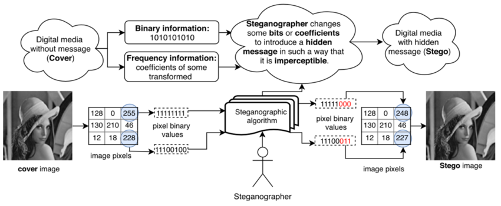

## Tools

| Tool                                                                             | Description                                    |
| -------------------------------------------------------------------------------- | ---------------------------------------------- |
| [TweakPNG](https://entropymine.com/jason/tweakpng/)       | PNG structure editor and chunk inspector       |
| [Pngcheck](https://github.com/pnggroup/pngcheck)          | Validates and analyzes PNG file chunks         |
| [zsteg](https://github.com/zed-0xff/zsteg)                | Detects LSB steganography in PNG/BMP files     |
| [stegseek](https://github.com/RickdeJager/stegseek)       | Fast steghide password cracker and extractor   |
| [steghide](https://steghide.sourceforge.net/)             | Embeds and extracts hidden data in media files |
| [stegsolve](http://www.caesum.com/handbook/Stegsolve.jar) | Java GUI for visual steganography analysis     |
| [iSteg](https://github.com/rafiibrahim8/iSteg)            | Simple image steganography encoder/decoder     |

### Online tools

| Tool                                                                                                 | Description                                              |
| ---------------------------------------------------------------------------------------------------- | -------------------------------------------------------- |
| [Forensically](https://29a.ch/photo-forensics/#forensic-magnifier)            | Online image forensics and metadata analysis suite       |
| [FotoForensics](https://fotoforensics.com/)                                   | Error Level Analysis (ELA) and image tampering detection |
| [StegOnline](https://www.georgeom.net/StegOnline/upload)                      | Browser-based PNG steganography analysis tool            |
| [Aperi'Solve](https://www.aperisolve.com/)                                    | Automated steganography and file analysis platform       |
| [Steganographic Decoder](https://futureboy.us/stegano/decinput.html)          | Decodes hidden messages from simple steganography        |
| [Steganography Online](https://stylesuxx.github.io/steganography/)            | Web tool for hiding and extracting text in images        |
| [Hexadecimal -> image](https://codepen.io/abdhass/full/jdRNdj)                | Converts hexadecimal pixel data into images              |
| [QRCode Reader - Aspose](https://products.aspose.app/barcode/fr/recognize/qr) | Online QR code recognition and decoding                  |
| [Inlite](https://online-barcode-reader.inliteresearch.com/)                   | Online barcode and QR code reader                        |

## Techniques

### LSB

- [Wikipedia - LSB Steganograhy](https://en.wikipedia.org/wiki/Bit_numbering#Least_significant_bit_in_digital_steganography)

**Least Significant Bit (LSB)** steganography is a technique to hide bits of data in the least significant bits of the channels of an image or audio file.

### PVD

**Pixel Value Differencing** (PVD) technique is a ...

- [A Steganographic Method Based on Pixel-Value Differencing and the Perfect Square Number](https://onlinelibrary.wiley.com/doi/epdf/10.1155/2013/189706)
- [Pixel-Value Differencing Steganography: Attacks and Improvements](https://www.academia.edu/4849962/Pixel_Value_Differencing_Steganography_Attacks_and_Improvements)

### EMD

- [Efficient Steganographic Embedding by Exploiting Modification Direction](https://staff.emu.edu.tr/alexanderchefranov/Documents/CMSE492/ZhangIEEECL2006.pdf)

### PIT

- [Pixel Indicator Technique for RGB Image Steganography](https://www.academia.edu/22689053/Pixel_Indicator_Technique_for_RGB_Image_Steganography)
- [StegoPIT](https://gist.github.com/dhondta/30abb35bb8ee86109d17437b11a1477a)

**Pixel Indicator Technique** (PIT) is a ...

### LPS

- [Linked Pixel Steganography](https://bitsdeep.com/projects/linked-pixel-steganography/)
- [GitHub - Linked-Pixel-Steganography](https://github.com/FlorianPicca/Linked-Pixel-Steganography)

**Linked Pixel Steganography (LPS)** technique is a variant of the well-known [**LSB**](#lsb) steganography where one channel stores the actual data while the other stores the position/coordinates of the next chunk of data.

## Resources
