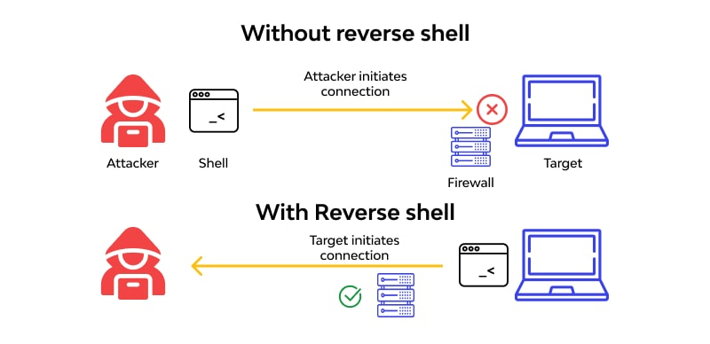

## What is a Reverse Shell ?

A **reverse shell** is a type of shell where the target machine opens a connection to the attacker’s machine, allowing the attacker to execute commands on the target system.

## What is a Bind Shell ?

A **bind shell** is a type of shell where the attacker opens a connection to the target machine, allowing the attacker to execute commands on the target system. This is often used in penetration testing and red teaming scenarios to gain control over a compromised system.

## Tools

| Tool                                                                         | Description                                                           |
| ---------------------------------------------------------------------------- | --------------------------------------------------------------------- |
| [ngrok](https://ngrok.com/)                           | Secure tunneling service that exposes local services to the internet  |
| [localhost.run](https://localhost.run/)               | Simple SSH-based tunneling service for exposing local servers         |
| [Reverse Shell Generator](https://www.revshells.com/) | Generates reverse shell payloads for multiple platforms and languages |

## Resources

- [Reverse Shell Cheat Sheet](https://highon.coffee/blog/reverse-shell-cheat-sheet/)
- [HackTricks - Linux Shells](https://hacktricks.wiki/fr/generic-hacking/reverse-shells/linux.html)
